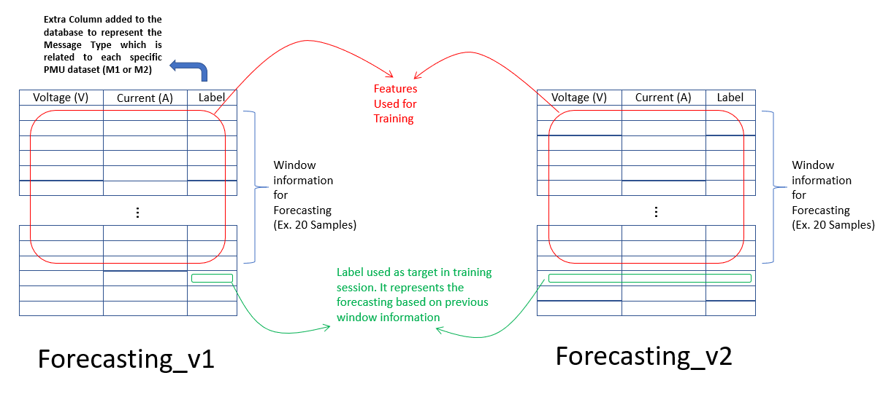
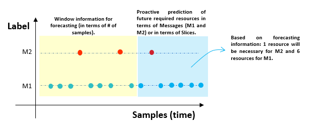
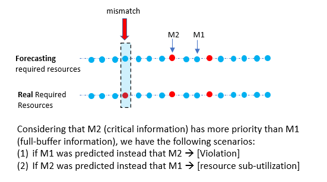

# Requirements
Install in your environment (Ex. Conda) the libraries related to PyTorch. 

For example, if you are using conda, you can run the following commands:

```shell
conda install pytorch torchvision -c pytorch

python -m pip install seaborn

pip install -U scikit-learn scipy matplotlib
```


If you are using a linux environmet, maybe this link can be useful https://timoast.github.io/blog/installing-pytorch/

Other important requirement is the dataset. Please, download the following files and delete the lines with extra information that is not related to the dataset (name of columns, explanation of the dataset, etc in the initial lines and in the last line of each file).

http://nanotera-stg2.epfl.ch/data/2019/Apr/01/2019-04-01_00h_UTC_PMUID01.txt

http://nanotera-stg2.epfl.ch/data/2019/Apr/01/2019-04-01_00h_UTC_PMUID02.txt


# RANslicing_forecasting
Framework development based on 5G RAN Slicing premisses supporting Vertical protocols, such as IEC-61850

# Initial release
We have two well defined blocks to get numerical results. The first one is related to "forecasting" and the second is a "resource allocation" block based on the forecasting.

## Forecasting
### Dataset description
The start point is based on the elastic dataset to be used on the forecasting model. Two different scenarios where considered. These are deployed in **forecasting_v1.ipynb** and **forecasting_v2.ipynb** jupyter projects.



### Forecasting example and data analysis
After a trained model is obtained, some information samples are forecasting. These forecasted information is used to evaluate the required resources on each window time frame into an specific RAN Slicing scheduling mechanism.



### Resouce allocation and potential metrics
With the comparison of forecasting information and original information, two potential metrics can be analyzed: Violation and resource sub-utilization.


